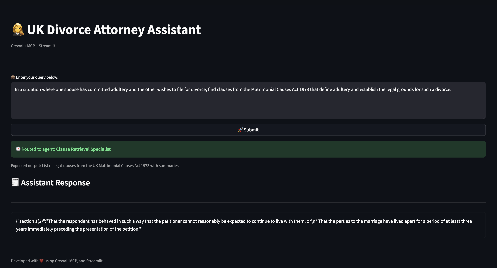
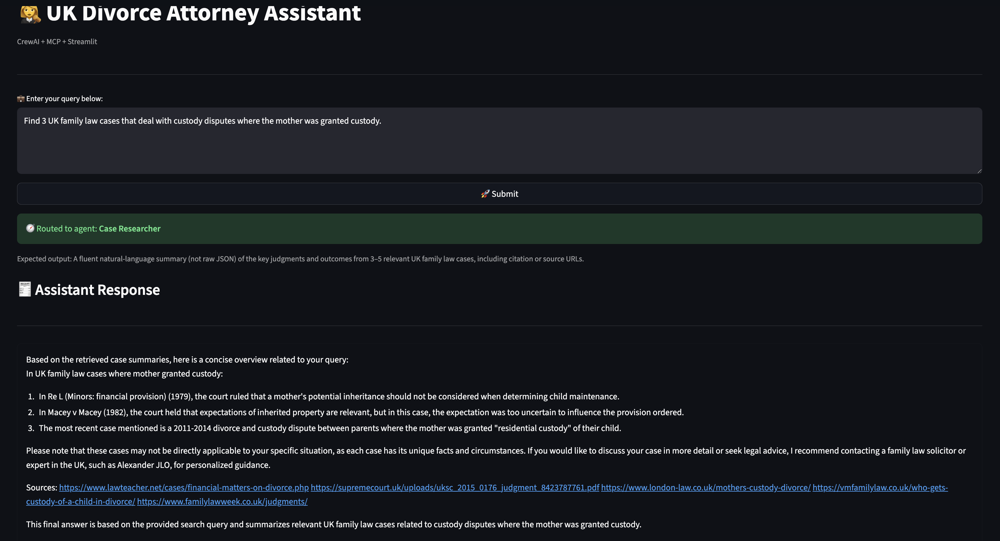
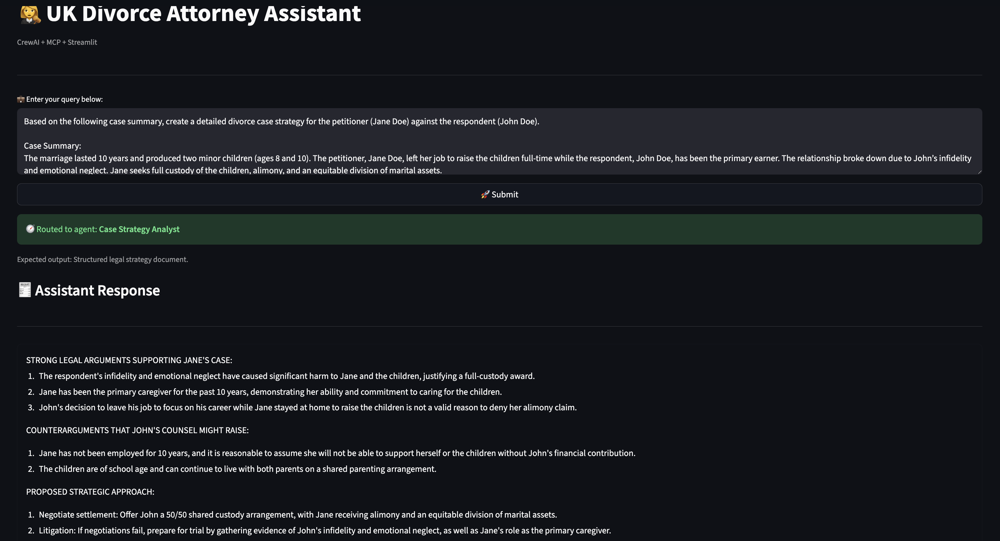

# ⚖️ UK Divorce Attorney Assistant (CrewAI + MCP + Streamlit + Ollama)

<p align="center">
  
</p>

<h1 align="center">⚖️ UK Divorce Attorney AI Assistant/h1>

<p align="center" style="font-size: 16px;">


> **An AI-powered UK Divorce Law Assistant** built with **CrewAI**, **Model Context Protocol (MCP)**, and **Streamlit** — capable of retrieving legal clauses, analyzing precedent cases, drafting legal strategies, and generating professional divorce petitions, all orchestrated through intelligent multi-agent collaboration.

---

## 📖 Overview

This project is a full-fledged **Legal AI Workflow System** designed to mimic a **UK Family Law Attorney’s digital assistant**.


It leverages:
- **CrewAI** → for multi-agent orchestration (clause retrieval, case research, strategy analysis, petition drafting)
- **MCP (Model Context Protocol)** → by Anthropic, for connecting external tools and servers to the LLMs
- **LLMs (Ollama / Llama 3)** → for reasoning, writing, and decision routing
- **Hybrid Retrieval Pipeline** → Dense + Lexical + Metadata search architecture with reranking and query rewriting.
- **FAISS** → for semantic vector search of legal texts
- **Pydantic** → for schema validation and safe data transfer in tool interactions
- **Streamlit** → for an interactive web-based interface
- **UV** → for dependency management and virtual environment setup (used instead of pip/conda)

Together, these components enable natural-language interaction with multiple autonomous legal agents that handle different stages of a divorce case.

---

## 🧩 Core Capabilities

| Agent | Role | Description |
|--------|------|-------------|
| **Clause Retrieval Specialist** | Legal Researcher | Uses hybrid (semantic + lexical + metadata) retrieval to find relevant statutory clauses from the Matrimonial Causes Act 1973.|
| **Case Researcher** | Precedent Finder | Searches and summarizes 3–5 similar UK family law judgments from case repositories |
| **Case Strategy Analyst** | Legal Strategist | Drafts professional legal arguments, counter-arguments, and litigation strategies |
| **Petition Writer** | Document Drafter | Generates court-ready divorce petitions following official UK Family Court structure |
| **General Chat** | Conversational Assistant | Handles general inquiries or meta-level discussions about divorce law |

---

## ⚙️ Tech Stack

| Component | Technology |
|------------|-------------|
| Agents Framework | [CrewAI](https://docs.crewai.com/) |
| Tool Interface | [Model Context Protocol (MCP)](https://github.com/anthropic/mcp) |
| Vector Database | FAISS |
| Embeddings | Sentence-Transformers – BAAI/bge-base-en-v1.5 |
| Large Language Model | [Ollama – Llama 3](https://ollama.ai/library/llama3) |
| UI | [Streamlit](https://streamlit.io/) |
| Data Cleaning | Unstructured |
| Dependency & Env Mgmt | [uv](https://docs.astral.sh/uv/) |
| Language | Python 3.13 |
| Dataset | **UK Matrimonial Causes Act 1973 (annotated & embedded)** |

---

## 🧠 Legal Data Source

The project’s **legal clause retrieval** is powered by a vectorized version of the  
📜 **Matrimonial Causes Act 1973 (United Kingdom)**.

Data Preparation Pipeline

- Cleaning & Structuring – Removes headers, footers, and OCR noise using the unstructured library.
- Metadata Extraction – Captures section numbers, titles, summaries, categories, and legal concepts.
- Semantic Chunking – Divides text based on logical boundaries and similarity thresholds.
- Vectorization – Embeds chunks using BAAI/bge-base-en-v1.5 into FAISS.
- Storage – Creates a searchable local vector store with hybrid retrieval capabilities.

This allows context-aware legal retrieval — for example, understanding that “irretrievable breakdown” refers to five statutory facts under Section 1(2) of the Act.
---

## 🔍 Retrieval Pipeline Architecture

The system uses a hybrid retrieval approach combining multiple signal types for precise and contextually rich legal search.

###Retrieval Steps

1- Query Rewriting (LLM-based)
The user’s query is rewritten into a legally detailed and specific version using Llama 3.

2- Hybrid Search (Dense + Lexical + Metadata)

Dense: FAISS similarity over sentence embeddings.

Lexical: BM25 keyword-based relevance scoring.

Metadata Boosting: Category and clause-number matching improve accuracy.

3- Reranking (Cross-Encoder)
A BAAI/bge-reranker-base model reorders top candidates to maximize contextual precision.

4- Summarization (LLM)
Retrieved chunks are summarized into concise, legally accurate explanations.


## Vector Database (FAISS Hybrid Index)

- Each clause from the Matrimonial Causes Act 1973 is converted into high-dimensional vector embeddings representing its semantic meaning.
- These embeddings are stored locally in a FAISS (Facebook AI Similarity Search) index for fast, offline similarity retrieval.
- The find_relevant_clauses MCP server queries this FAISS index using a hybrid search approach that combines dense semantic vectors, lexical keyword scoring, and metadata matching.
- The FAISS index is automatically loaded and ready when the clause retrieval server starts, ensuring instant, low-latency legal clause search.


Example:
```python
Action: find_relevant_clauses
Action Input: {"query": "adultery and irretrievable breakdown of marriage"}
```

## PROJECT STRUCTURE
```
Attorney-RAG/
├── __pycache__
│   └── retrieval_pipeline.cpython-313.pyc
├── built_vector_db.py
├── client
│   ├── app.py
│   ├── divorce_attorney_client_v2.py
│   └── divorce_attorney_client.py
├── data
│   └── laws
│       ├── legal_document.pdf
│       ├── UK_Divorce_Act_chunks_metadata.json
│       └── UK_Divorce_Act_clean.json
├── main.py
├── output
│   └── peitition.txt
├── pyproject.toml
├── README.md
├── retrieval_pipeline.py
├── screenshots
│   ├── case_researcher.png
│   ├── case_strategy_analyst.png
│   └── clause_retrieval.png
├── servers
│   ├── __pycache__
│   │   └── clause_retrieval_server.cpython-313.pyc
│   ├── case_retrieval_server.py
│   ├── case_strategy_server.py
│   ├── clause_retrieval_server.py
│   ├── model.py
│   └── petition_template_server.py
├── title_img.png
├── uv.lock
└── vector_stores
    ├── faiss_divorce_act
    │   ├── index.faiss
    │   └── index.pkl
    └── faiss_laws
        ├── index.faiss
        └── index.pkl
---
``` 

## 📸 Screenshots & Demo

Below are example outputs from the **UK Divorce Attorney AI System**, showing how different agents (CrewAI + MCP) interact to handle real legal scenarios.

---

### 📘 Clause Retrieval Agent  
**Scenario:**  
> In a situation where one spouse has committed adultery and the other wishes to file for divorce — find clauses from the *Matrimonial Causes Act 1973* that define adultery and establish the legal grounds for such a divorce.

**Result:**  
The agent retrieved **Section 1(2)** of the *Matrimonial Causes Act 1973*, explaining the legal basis for adultery as a valid ground for divorce.



---

### ⚖️ Case Researcher Agent  
**Scenario:**  
> Find and summarize 3 UK family law cases that deal with custody disputes where the mother was granted custody .

**Result:**  
The agent provided summarized **case precedents**, including judgment outcomes, reasoning, and relevant URLs — offering clear insight into custody decisions under UK family law.



---

### 🧠 Case Strategy Analyst Agent  
**Scenario:**  
> Based on the following details — John Doe and Jane Doe have been married for 10 years and have two children (ages 8 and 10). Generate a legal strategy outlining arguments, counterarguments, and next steps.

**Result:**  
The agent produced a structured **legal strategy document**, including key arguments, suggested approaches, and potential counterpoints grounded in UK family law.



---

Each agent operates autonomously via **CrewAI**, leveraging **LLM reasoning**, **vector-based retrieval**, and **MCP microservices** for accurate, document-grounded legal intelligence.


## How Does it Work


**User Query (via Streamlit)**

The lawyer inputs a natural query like
“Draft a divorce petition for Jane Doe vs John Doe under the 1973 Act.”


**Routing via CrewAI LLM**

The Llama 3 model analyzes the query and routes it to the most appropriate agent through
route_query_to_agent_llm().


**Agent Task Execution**
Each agent has a CrewAI Task object that defines its description, expected output, and assigned tools.

**Tool Invocation (via MCP)**
 Agents call MCP servers (like find_relevant_clauses, find_similar_cases, generate_legal_strategy, draft_petition).

**Vector Retrieval & LLM Reasoning**
The MCP servers perform vector similarity searches (for clauses) or generate responses (for strategy/petition).

**Result Delivery**
The processed, structured output is streamed back to the Streamlit interface, formatted for readability.

## Installation & Setup


### 1️⃣ Clone the Repository
``` 
git clone https://github.com/abdullahhunjra/agentic-divorce-attorney-ai-system-crewai-mcp-ollama-streamlit.git
cd attorney-rag
``` 

2️⃣ Initialize the Environment
``` 
uv init
``` 

3️⃣ Install Dependencies

Since this project uses pyproject.toml, simply run:
``` 
uv sync
``` 


This installs all dependencies defined under [project.dependencies].

4️⃣ Start Ollama
``` 
ollama serve
ollama pull llama3
``` 

5️⃣ Start MCP Servers

In separate terminals, run:

``` 
uv run python servers/clause_template_server.py
uv run python servers/case_research_template_server.py
uv run python servers/strategy_template_server.py
uv run python servers/petition_template_server.py
``` 

6️⃣ Launch Streamlit Interface
``` 
uv run streamlit run client/app.py
``` 


Now open your browser at:
👉
``` 
http://127.0.0.1:8501
``` 

💬 Example Queries
📘 Clause Retrieval

“From the Matrimonial Causes Act 1973, find clauses related to irretrievable breakdown and adultery.”

⚖️ Case Research

“Summarize 3 UK cases involving custody disputes where the mother was granted custody.”

🧠 Strategy Builder

“Based on the following case summary, generate arguments, counterarguments, and a proposed litigation strategy.”

📝 Petition Drafting

“Draft a formal divorce petition for:
Petitioner: Jane Elizabeth Doe
Respondent: John Michael Doe
Lawyer: Mr. Richard Allan, Allan & Co. Family Law Chambers, London.”

``` 

## 🙋‍♂️ Author

**Abdullah Shahzad**  
📧 [abdullahhunjra@gmail.com](mailto:abdullahshahzadhunjra@gmail.com)  
🔗 [LinkedIn](https://www.linkedin.com/in/abdullahhunjra)  
💻 [GitHub](https://github.com/abdullahhunjra)

---